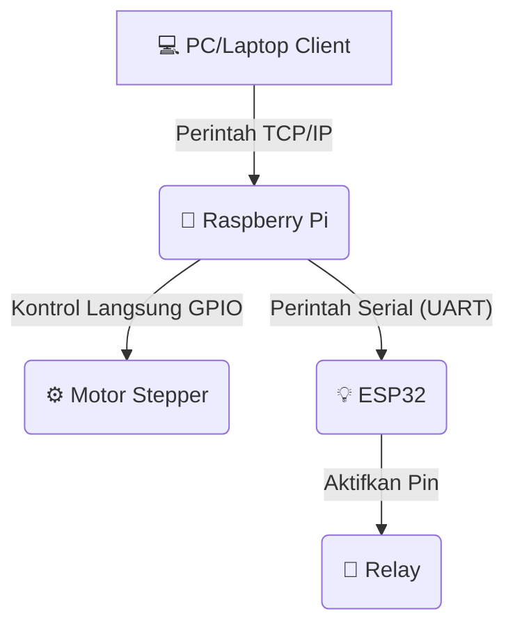

# Proyek Sarva-Motor

**Proyek Sarva-Motor** adalah sistem terintegrasi untuk mengendalikan hingga 7 motor stepper dan 7 relay secara sinkron melalui perintah jarak jauh. Sistem ini menggunakan arsitektur tiga komponen: PC/Laptop sebagai client, Raspberry Pi sebagai otak pengendali motor, dan ESP32 sebagai eksekutor relay yang terhubung secara serial (UART).

---

## Diagram Arsitektur



Alur perintah dalam sistem ini:

1. PC/Laptop Client mengirimkan perintah melalui protokol TCP/IP ke Raspberry Pi.
2. Raspberry Pi mengendalikan motor stepper secara langsung lewat GPIO.
3. Raspberry Pi mengirim perintah serial (UART) ke ESP32.
4. ESP32 mengaktifkan/mematikan relay sesuai perintah.

---

## Fitur Utama

- **Kontrol Sinkron**: Mengendalikan hingga 7 motor stepper dan 7 relay secara bersamaan.
- **Arsitektur Client-Server**: Kendali jarak jauh dari PC/Laptop mana pun di jaringan.
- **Komunikasi Andal**: Serial (UART) stabil dan cepat antara Raspberry Pi dan ESP32, tanpa ketergantungan Wi-Fi antar mikrokontroler.
- **Modular**: Kode terpisah untuk PC Client, Pi Server, dan ESP32 Firmware, sehingga mudah dipelihara dan dikembangkan.

---

## Struktur Proyek

```plaintext
sarva-motor/
├── raspberry_pi/
│   ├── main_server.py            # Skrip server utama yang dijalankan di Pi
│   └── requirements.txt          # Dependensi Python untuk Pi
├── esp32/
│   └── relay_serial_firmware.ino # Firmware untuk di-upload ke ESP32
├── pc_client/
│   └── kirim_perintah.py         # Skrip untuk mengirim perintah dari PC/Laptop
└── README.md                     # Dokumen ini
```

---

## Memulai Proyek

### Prasyarat

**Hardware:**

- PC/Laptop untuk mengirim perintah
- Raspberry Pi (model apa pun dengan GPIO)
- ESP32 DevKit
- Motor Stepper dan driver (misal A4988 atau DRV8825)
- Modul Relay 8-Channel
- Power Supply yang sesuai untuk motor dan relay
- Kabel jumper

**Software:**

- Python 3 di PC dan Raspberry Pi
- Arduino IDE dengan board ESP32 terinstal
- Git

### Langkah 1: Pengkabelan & Konfigurasi Raspberry Pi

1. **Hubungkan perangkat keras:**

   - Driver motor stepper → pin GPIO Raspberry Pi
   - Modul relay → pin GPIO ESP32
   - Pi GND ↔ ESP32 GND (WAJIB)
   - Pi TX (GPIO14) ↔ ESP32 RX2 (GPIO16)
   - Pi RX (GPIO15) ↔ ESP32 TX2 (GPIO17)

2. **Aktifkan serial port di Raspberry Pi:**

   ```bash
   sudo raspi-config
   # Pilih Interface Options → I6 Serial Port
   # Pilih 'No' untuk login shell, lalu 'Yes' untuk hardware serial port
   sudo reboot
   ```

### Langkah 2: Setup ESP32

1. Buka `esp32/relay_serial_firmware.ino` di Arduino IDE.
2. Pilih board **ESP32 Dev Module** dan port yang sesuai.
3. Upload firmware ke ESP32.

### Langkah 3: Setup Raspberry Pi

1. Clone repositori:
   ```bash
   git clone https://github.com/adrianramadhan/sarva-motor.git
   cd sarva-motor
   ```
2. Siapkan lingkungan Python (direkomendasikan):
   ```bash
   python3 -m venv sarva
   source sarva/bin/activate
   ```
3. Install dependensi:
   ```bash
   pip install -r raspberry_pi/requirements.txt
   # Pastikan requirements.txt mencantumkan pyserial dan RPi.GPIO
   ```

### Langkah 4: Setup PC Client

1. Buka dan edit `pc_client/kirim_perintah.py`: sesuaikan alamat IP Raspberry Pi.

---

## Penggunaan

1. Pastikan semua perangkat terhubung dan menyala.
2. **Jalankan server di Raspberry Pi:**
   ```bash
   cd sarva-motor/raspberry_pi
   source ../sarva/bin/activate  # Jika menggunakan virtual environment
   python3 main_server.py
   ```
3. **Kirim perintah dari PC/Laptop:**
   ```bash
   cd sarva-motor/pc_client
   # Menyalakan motor 1 dan relay 1
   python3 kirim_perintah.py "start:m1"

   # Mematikan motor 4 dan relay 4
   python3 kirim_perintah.py "stop:m4"
   ```

---

## Kontribusi

Kontribusi sangat disambut! Jika Anda memiliki saran atau perbaikan:

1. Fork repositori ini.
2. Buat branch baru (`git checkout -b fitur/nama-fitur`).
3. Lakukan perubahan Anda.
4. Commit perubahan (`git commit -m "Tambahkan fitur baru"`).
5. Push ke branch (`git push origin fitur/nama-fitur`).
6. Buka Pull Request.

---

## Lisensi

Proyek ini dilisensikan di bawah **MIT License**.

